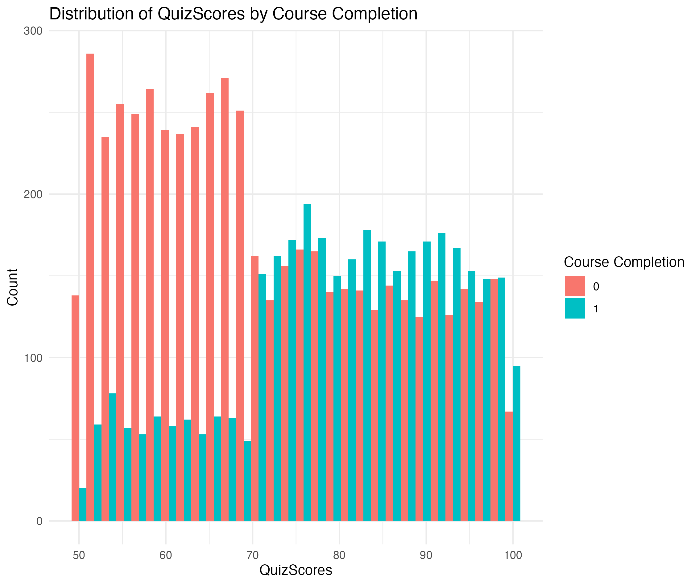
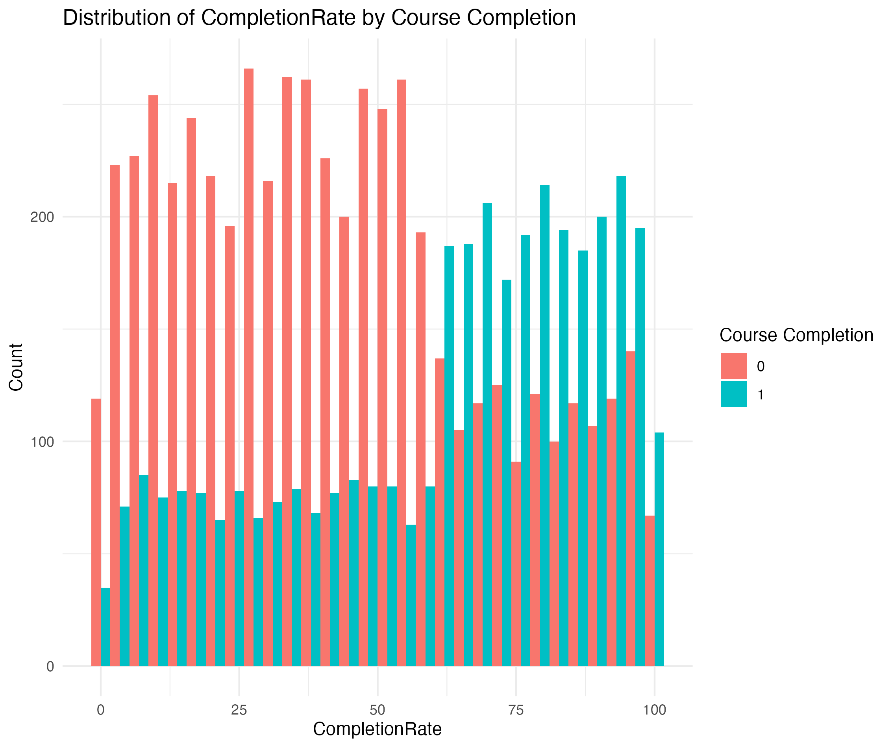
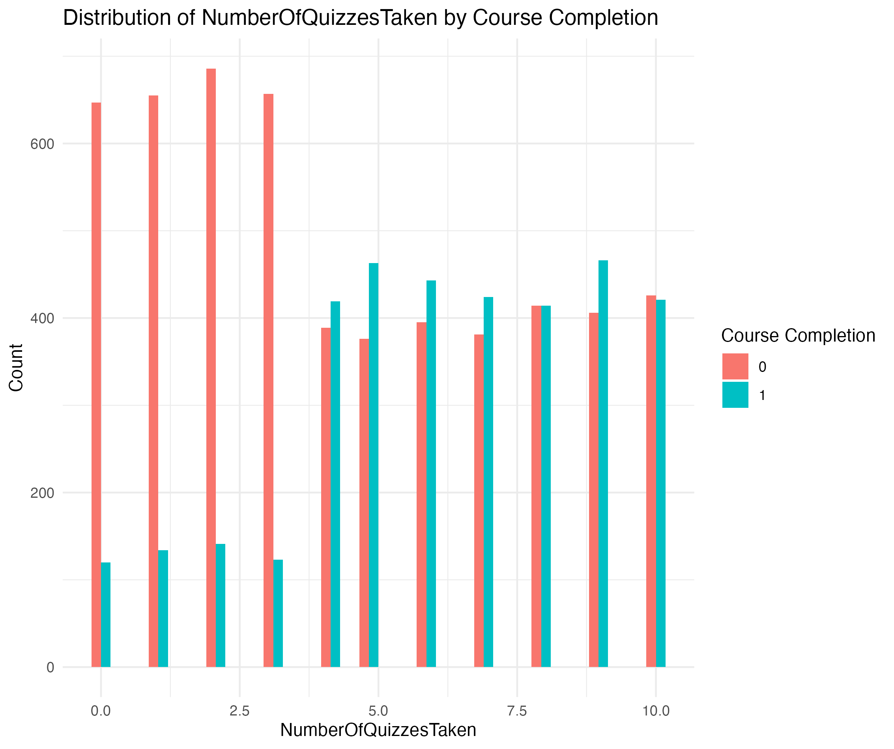

# MOCC Completion Analysis

## Project Overview
This project focuses on analyzing user engagement data from an online course platform to predict course completion. The analysis identifies key factors influencing course completion and provides actionable recommendations for improving user engagement.

## Dataset Overview
The dataset contains the following key features:
- **User Engagement Metrics**: Time spent on the course, videos watched, quizzes taken, and quiz scores.
- **Demographics and Device Usage**: Device type (desktop or mobile).
- **Completion Metrics**: Course completion status (completed or not completed).

### Key Dataset Statistics
| Metric                  | Value                        |
|-------------------------|------------------------------|
| Number of Users         | 9,000                        |
| Average Time Spent      | 50.16 hours                  |
| Average Video Watched   | 10.02 videos                 |
| Average Quiz Taken      | 5.09 quizzes                 |
| Average Quiz Scores     | 74.71                        |
| Content Completion Rate | 50.34%                       |
| Course Completion Rate  | 39.64%                       |
| Device Usage            | 50.07% Desktop, 49.93% Mobile|

## Analysis Approach
1. **Exploratory Data Analysis (EDA)**:
   - Distribution of key metrics like time spent, quiz scores, and videos watched.
   - Correlation analysis to identify relationships between features.
2. **Model Building**:
   - Logistic Regression.
   - Random Forest (selected as the final model).
   - XGBoost.
3. **Cross-Validation**:
   - Applied 5-fold cross-validation to ensure model robustness.

## Model Comparison
| Metric               | Logistic Regression | XGBoost       | Random Forest (Final) |
|----------------------|---------------------|---------------|------------------------|
| **Accuracy**         | 81.17%             | 95.67%        | 96.06%                |
| **AUC**              | 0.87               | 0.96          | 0.96                  |
| **Sensitivity**      | ~81%               | 97.21%        | 97.75%                |
| **Specificity**      | ~81%               | 93.16%        | 93.30%                |

## Key Findings
### Feature Importance (Random Forest)
1. **CompletionRate**: Strongest predictor of course completion. Students with higher progress are more likely to complete the course.
2. **NumberOfQuizzesTaken**: Quiz participation significantly correlates with course completion.
3. **QuizScores**: Higher quiz scores indicate better engagement and understanding of the material.

## Recommendations
1. **Encourage Quiz Participation**:
   - Incentivize quizzes using badges, rewards, or points.
   - Provide detailed feedback to improve scores.
2. **Promote Milestone Tracking**:
   - Notify students at progress milestones (e.g., 50%, 75%).
   - Use gamification to encourage course completion.
3. **Highlight Critical Videos**:
   - Identify essential videos and remind students to watch them.
   - Make videos more interactive to boost engagement.

## Visualizations
### Feature Importance


### Top Features by Course Completion
1. **CompletionRate**:
   
2. **NumberOfQuizzesTaken**:
   
3. **QuizScores**:
   

## How to Run the Dashboard
1. Clone the repository:
   ```bash
   git clone <repository-url>
2. Open dashboard_app.R in RStudio.
3. runApp("dashboard_app.R")